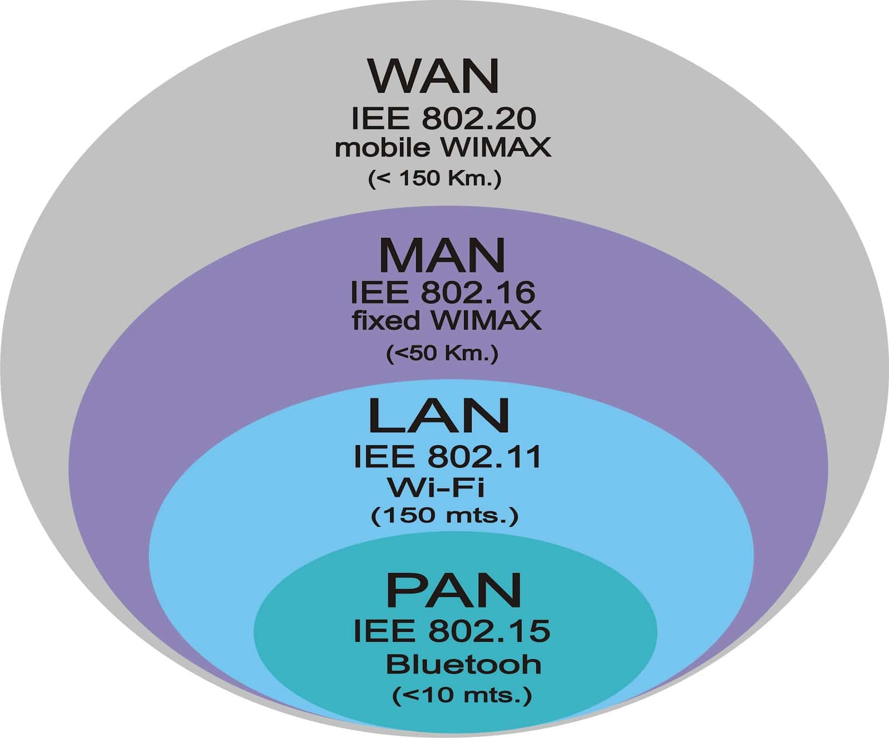
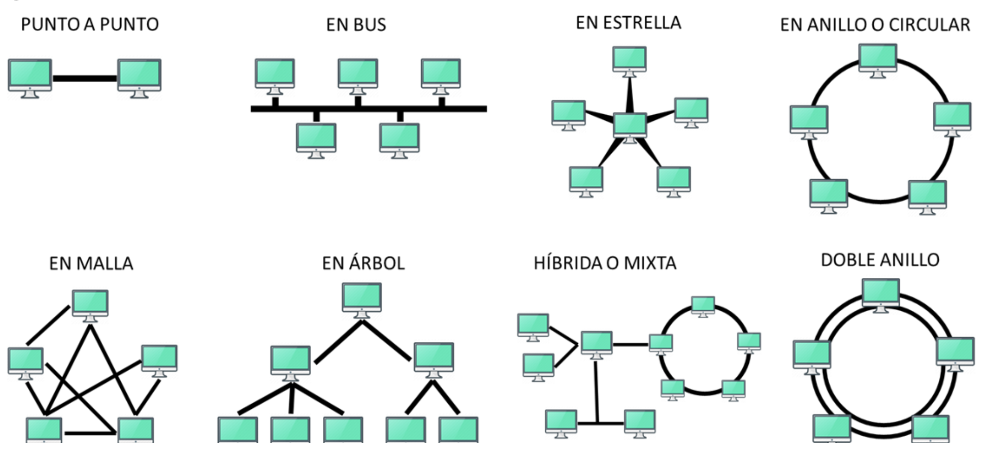
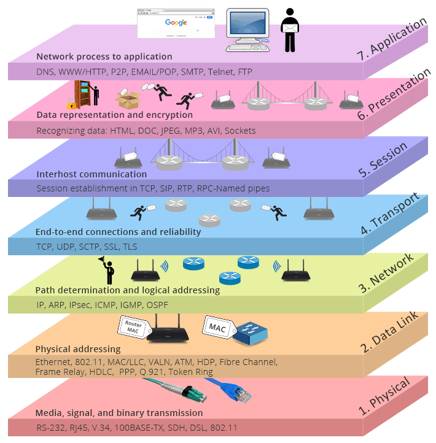
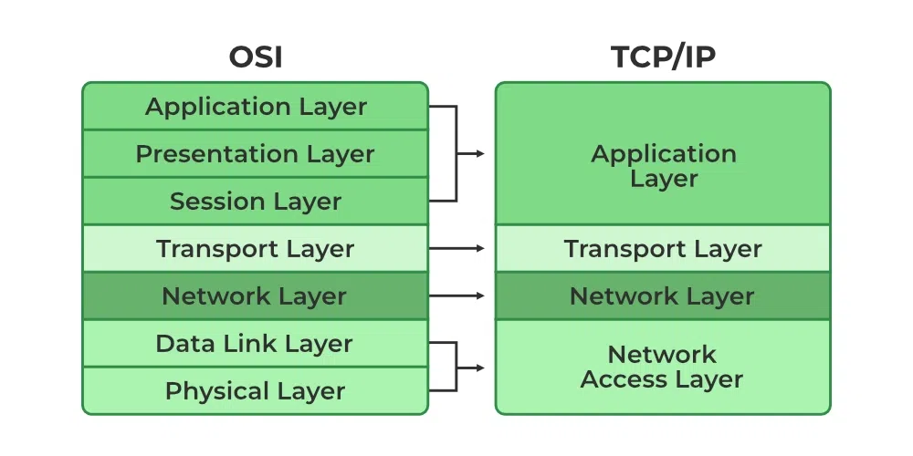
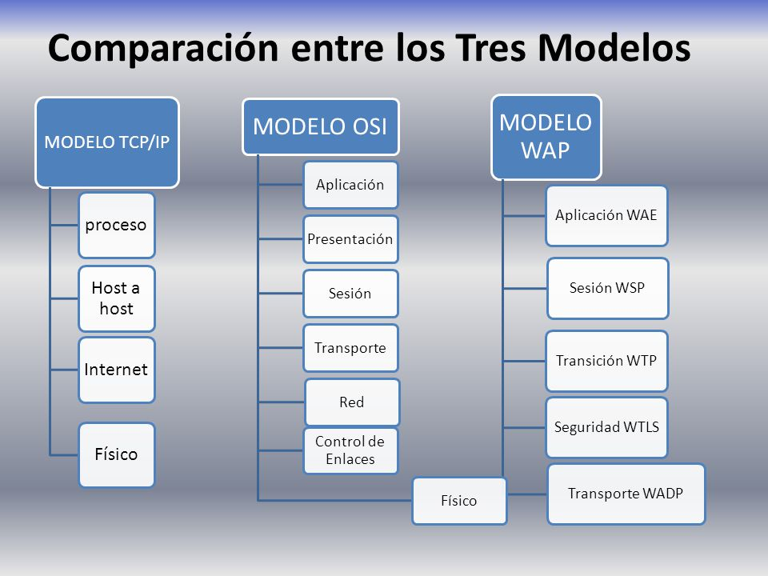

## 1.1 Introducción a las redes

### 1.1.1 Definición de Red.

Una red de comunicación es un conjunto de dispositivos interconectados que se utilizan para transmitir datos, recursos y servicios entre sí. Estos dispositivos, también conocidos como nodos, están conectados mediante cables, enlaces inalámbricos u otros medios de transmisión. El propósito principal de una red es permitir la comunicación y el intercambio de información entre los dispositivos conectados.

### 1.1.2 Elementos de red: Nodo y Host

- **Nodo:** En el contexto de las redes de comunicación, un nodo se refiere a cualquier dispositivo que forma parte de la red. Un nodo puede ser una computadora, un enrutador, un conmutador, un servidor, un teléfono inteligente, una impresora, entre otros dispositivos. Cada nodo tiene una dirección única en la red que se utiliza para identificarlo y direccionar la comunicación hacia él.

- **Host:** En el ámbito de las redes, el término "host" se utiliza para referirse a un dispositivo final que puede iniciar o recibir comunicaciones en una red. Por lo general, los hosts son computadoras personales, laptops, tablets o teléfonos inteligentes que están conectados a la red y que los usuarios utilizan para acceder a servicios y recursos. Los hosts suelen tener direcciones IP únicas asignadas a ellos, lo que les permite ser identificados y comunicarse con otros dispositivos en la red.

Es importante destacar que los términos "nodo" y "host" a menudo se utilizan indistintamente para referirse a dispositivos en una red, aunque algunos pueden considerar que "nodo" tiene un sentido más amplio, que incluye dispositivos de infraestructura como enrutadores y conmutadores, mientras que "host" se refiere específicamente a los dispositivos finales utilizados por los usuarios.

## 1.2 Clasificación de redes por área y por topología

### 1.2.1 Redes por área:LAN, HAN, CAN, MAN, WAN y PAM

**LAN (Local Area Network):** Es una red de área local que conecta dispositivos dentro de un área geográfica limitada, como una oficina, un edificio o una casa. Las LAN suelen ser de propiedad privada y están diseñadas para permitir la comunicación de datos y recursos entre los dispositivos conectados.

**HAN (Home Area Network):** Es una red de área local que se utiliza en el entorno doméstico. Permite la interconexión de dispositivos electrónicos dentro de una casa, como computadoras, impresoras, teléfonos inteligentes, televisores, etc.

**CAN (Campus Area Network):** Es una red de área local que cubre un área geográfica más amplia, como un campus universitario, una organización o una empresa grande. Las CAN suelen utilizar tecnologías de red similares a las LAN, pero con un alcance mayor.

**MAN (Metropolitan Area Network):** Es una red de área metropolitana que cubre una ciudad o una región geográfica extensa. Las MAN conectan múltiples ubicaciones dentro de una zona geográfica limitada y se utilizan para proporcionar conectividad a organizaciones o instituciones dispersas en una ciudad o área metropolitana.

**WAN (Wide Area Network):** Es una red de área amplia que cubre una gran área geográfica, como un país, un continente o incluso el mundo entero. Las WAN se utilizan para conectar redes más pequeñas entre sí y permitir la comunicación a larga distancia. Internet es el ejemplo más conocido de una WAN global.

**PAM (Pulse Amplitude Modulation):** PAM es una técnica de modulación utilizada en las comunicaciones digitales para transmitir señales analógicas a través de una amplitud de pulso variable. Se utiliza en diversas aplicaciones, como en sistemas de transmisión de audio y video digital.

Es importante destacar que la lista anterior representa conceptos y siglas comúnmente utilizados en el campo de las redes de comunicación, pero no existe una combinación de términos llamada "Redesporárea". Si tienes alguna pregunta adicional o necesitas información más detallada sobre alguno de estos conceptos, no dudes en preguntar.

### 1.2.2 Topologias de Red y tipos de servicio:

#### Topologias de Red

**Topología en estrella:** Todos los nodos de la red están conectados a un nodo central, conocido como concentrador o switch. Este nodo central gestiona y controla las comunicaciones entre los dispositivos conectados.

**Topología en bus:** Todos los nodos de la red están conectados a un único medio de transmisión compartido, como un cable coaxial o una fibra óptica. Los datos transmitidos por un nodo son recibidos por todos los demás nodos, y cada nodo decide si debe procesarlos o no.

**Topología en anillo:** Los nodos se conectan formando un bucle cerrado, donde cada nodo está conectado al siguiente y el último está conectado al primero. Los datos circulan en una dirección específica alrededor del anillo, y cada nodo los recibe y transmite al siguiente.

**Topología en malla:** Cada nodo está conectado directamente a todos los demás nodos de la red. Esto crea múltiples rutas posibles para la transmisión de datos, lo que aumenta la redundancia y la confiabilidad de la red.

#### Tipos de Servicio

* **Servicio de voz:** Proporciona la capacidad de realizar llamadas de voz a través de la red. Es el servicio básico de telefonía y ha evolucionado hacia la telefonía IP en las redes de datos.

* **Servicio de datos:** Permite la transmisión de información en formato digital, como archivos, correos electrónicos, páginas web, etc. Es uno de los servicios fundamentales en las redes de comunicación actuales.

* **Servicio de video:** Ofrece la capacidad de transmitir y recibir contenido de video a través de la red. Esto incluye videoconferencias, transmisiones en tiempo real, servicios de streaming, entre otros.

* **Servicio de mensajería:** Permite el intercambio de mensajes de texto o multimedia entre usuarios. Incluye servicios como el correo electrónico, las aplicaciones de mensajería instantánea y las redes sociales.

## 1.3 Estandarización de las redes

### 1.3.1 Principales organizaciones de telecomunicaciones de México y el mundo:

#### México:

**Instituto Federal de Telecomunicaciones (IFT):** Es el organismo regulador en México encargado de promover la competencia y el desarrollo eficiente de las telecomunicaciones y la radiodifusión en el país.

**Teléfonos de México (Telmex):** Es una de las principales compañías de telecomunicaciones en México, que proporciona servicios de telefonía fija, Internet y televisión.

**Telecomunicaciones de México (Telecomm):** Es una empresa estatal mexicana encargada de administrar y operar infraestructuras de telecomunicaciones estratégicas en el país.

#### Mundo:

**International Telecommunication Union (ITU):** Es la agencia especializada de las Naciones Unidas para las tecnologías de la información y la comunicación. La ITU coordina el uso global del espectro de radiofrecuencias, promueve estándares técnicos y fomenta la cooperación internacional en el campo de las telecomunicaciones.

**Internet Engineering Task Force (IETF):** Es una comunidad abierta de ingenieros, proveedores de servicios, investigadores y otros expertos en Internet. La IETF se encarga de desarrollar y promover estándares técnicos y protocolos para el funcionamiento de Internet.

**International Organization for Standardization (ISO):** Es una organización internacional independiente que desarrolla y publica estándares en diversos campos, incluidas las telecomunicaciones. La ISO tiene un comité técnico (ISO/IEC JTC 1) que se ocupa de los estándares relacionados con las tecnologías de la información y las comunicaciones.

**Institute of Electrical and Electronics Engineers (IEEE)**: Es una asociación profesional global dedicada al avance de la tecnología en diferentes campos, incluyendo las telecomunicaciones. El IEEE desarrolla estándares técnicos en áreas como redes, comunicaciones inalámbricas, Ethernet, entre otros.

###  1.3.2 Principales organizaciones de estándares de México y el mundo

* **Comisión Nacional de Telecomunicaciones (CONATEL):** Es el organismo encargado de promover el desarrollo de las telecomunicaciones en México y establecer los estándares técnicos y de calidad para los servicios de telecomunicaciones en el país.

* **International Electrotechnical Commission (IEC):** Es una organización internacional que desarrolla estándares técnicos en el campo de la electrónica, la electricidad y las tecnologías relacionadas. Sus estándares son ampliamente utilizados en la industria de las telecomunicaciones.

* **Telecommunications Industry Association (TIA):** Es una asociación comercial estadounidense que representa a la industria de las telecomunicaciones y desarrolla estándares técnicos en áreas como redes, cableado estructurado, equipos de telecomunicaciones, entre otros.

Estas son solo algunas de las principales organizaciones de telecomunicaciones y estándares tanto a nivel mundial como en México. Cabe destacar que existen muchas otras organizaciones y entidades que desempeñan un papel importante en la estandarización y regulación de las redes y las telecomunicaciones.

## 1.4 Modelos de Referencia:

### 1.4.1 Modelo OSI (Open Systems Interconnection):
El modelo **OSI** es un modelo de referencia desarrollado por la Organización Internacional de Normalización (ISO) que proporciona una estructura conceptual para la comunicación de datos entre sistemas abiertos. 

Está compuesto por siete capas, cada una con funciones y protocolos específicos. Estas capas son: 

  * Capa física
  * Capa de enlace de datos
  * Capa de red
  * Capa de transporte
  * Capa de sesión
  * Capa de presentación
  * Capa de aplicación
    
El modelo OSI proporciona un enfoque modular para el diseño de redes, donde cada capa se encarga de tareas específicas, lo que facilita la interoperabilidad y el desarrollo de estándares.

### 1.4.2 Modelo TCP/IP (Transmission Control Protocol/Internet Protocol):

El modelo **TCP/IP** es un conjunto de protocolos de red ampliamente utilizado en Internet. A diferencia del modelo OSI, el modelo TCP/IP se compone de cuatro capas principales:

  - Capa de red (Network Layer) 

  - Capa de transporte (Transport Layer)

  - Capa de aplicación (Application Layer) 

 - Capa de enlace de Internet (Internet Link Layer)

  Cada capa del modelo TCP/IP tiene sus propios protocolos y funciones. El TCP/IP es considerado el protocolo fundamental de Internet y proporciona las bases para la comunicación de datos a nivel global.

  

### 1.4.3 WAP (Wireless Application Protocol):

El **WAP** es un estándar que permite el acceso a Internet y servicios basados en la web a través de dispositivos móviles, como teléfonos inteligentes y tablets. El WAP define un conjunto de protocolos de comunicación y especificaciones técnicas para la transmisión de datos a través de redes inalámbricas, como la tecnología de comunicaciones móviles conocida como **GSM**. 

El objetivo principal del WAP es adaptar los contenidos de Internet para que sean accesibles y visualizables en dispositivos con pantallas y capacidades limitadas.

En resumen, el modelo **OSI** es un modelo de referencia que proporciona una estructura conceptual para el diseño de redes, mientras que el modelo **TCP/IP** es un conjunto de protocolos utilizado en Internet. Por otro lado, el **WAP** es un estándar que permite el acceso a Internet y servicios web a través de dispositivos móviles.

